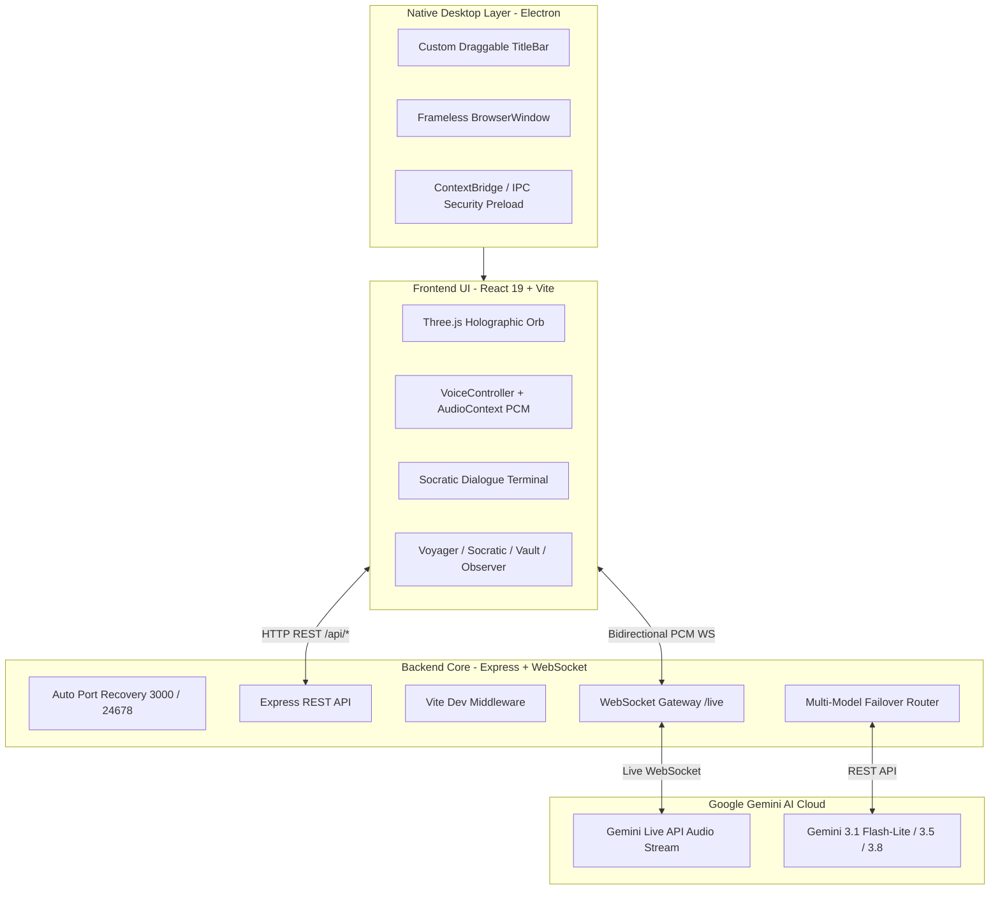

# KAIZEN — Autonomous J.A.R.V.I.S AI Partner

[](https://www.electronjs.org/)
[](https://react.dev/)
[](https://vitejs.dev/)
[](https://www.typescriptlang.org/)
[](https://tailwindcss.com/)
[](https://ai.google.dev/)

An autonomous, local-first Socratic AI companion engineered as a native OS desktop application. Embodying the persona of an erudite British butler with dry wit and intellectual rigor, **KAIZEN** challenges logical fallacies Socratically, streams real-time bidirectional voice via Google's Gemini Live API, and compiles lifelong engineering workflows into a local memory vault.

---

## Key Capabilities

- **Native Windows Desktop Experience**: Standalone frameless window powered by Electron with custom draggable title bar, window controls, and automatic microphone permissions.
- **Real-Time Bidirectional Voice Agent**: Low-latency WebSocket audio streaming (`audio/pcm;rate=16000`) integrated with Google's Gemini Live API (`gemini-3.1-flash-live-preview`), voice activity detection (VAD), and barge-in model interruption.
- **Resilient Multi-Model Failover**: Intelligent cascade routing across Gemini models (`gemini-3.1-flash-lite` &rarr; `gemini-3.5-flash` &rarr; `gemini-flash-latest` &rarr; `gemini-3.8-flash` &rarr; `gemini-3.7-flash`) with dynamic `.env` hot-reloading.
- **Interactive Three.js Holographic Orb**: 3D reactive particle orb reflecting cognitive states (`idle`, `listening`, `reasoning`, `speaking`).
- **Socratic Argumentation Engine**: Extracts premises, claims, and assumptions into structured graphs, challenging flaws with probing questions.
- **Teacher-Critic-Student Deliberation**: Internal multi-agent reasoning simulator that resolves consensus before vocalizing an answer.
- **Voyager Lifelong Skill Compiler**: Automates the synthesis of algorithmic workflows into versioned markdown skills saved to the vault.
- **Local Memory Vault**: Privacy-first local vault storage with full-text search simulation.

---

## Architecture Overview



---

## Getting Started

### Prerequisites

- **Node.js**: `v20.x` or later (tested on Node v24)
- **npm** or **bun**
- **Google Gemini API Key**: Obtain one from [Google AI Studio](https://aistudio.google.com/)

### Installation

1. Clone the repository:
   ```bash
   git clone https://github.com/Thenamudhan666/KAIZEN.git
   cd KAIZEN
   ```

2. Install dependencies:
   ```bash
   npm install
   ```

3. Configure your API key:
   ```bash
   cp .env.example .env
   ```
   Open `.env` and set your key:
   ```env
   GEMINI_API_KEY="your_gemini_api_key_here"
   ```

---

## Running the Application

### 1. Native Desktop Application (Electron)

Launch the native Windows desktop app:
```bash
npm run electron:dev
```
*Note: This automatically frees any stale ports (3000 & 24678) before launching the server and Electron window.*

### 2. Browser Development Mode

Run as a web application in your browser:
```bash
npm run dev
```
Navigate to [http://localhost:3000](http://localhost:3000).

### 3. Packaging Windows Executable (`.exe`)

Compile and build a standalone Windows installer:
```bash
npm run electron:build
```
The resulting installer will be generated in `release/`.

---

## Project Structure

```
KAIZEN/
├── assets/                  # Application icons & branding assets
│   └── icon.png             # 1024x1024 high-res app icon
├── electron.cjs             # Electron main process (window, IPC, permissions)
├── preload.cjs              # Secure contextBridge exposing window.electronAPI
├── server.ts                # Express server, WebSocket live gateway & Gemini client
├── vite.config.ts           # Vite build & development configuration
├── index.html               # SPA entry point with Electron CSP headers
├── package.json             # Scripts, dependencies & electron-builder configuration
├── tsconfig.json            # TypeScript compiler configuration
├── scripts/
│   └── clean-ports.cjs      # Port recovery utility (ports 3000 & 24678)
├── src/
│   ├── main.tsx             # React entry point
│   ├── App.tsx              # Main application layout & state machine
│   ├── index.css            # Tailwind CSS & global styles
│   ├── types.ts             # TypeScript definitions
│   └── components/
│       ├── TitleBar.tsx              # Draggable title bar with native window controls
│       ├── HolographicOrb.tsx        # Three.js 3D interactive particle visualizer
│       ├── VoiceController.tsx       # Live API WebSocket audio recorder & playback
│       ├── ActionRouterTerminal.tsx  # Interactive command action router
│       ├── MemoryVaultViewer.tsx     # Local vault search & markdown viewer
│       ├── SocraticDebatePanel.tsx   # Argumentation graph visualizer
│       ├── StudyAnalyzerPanel.tsx    # Socratic study material generator
│       ├── ScreenpipeObserver.tsx    # Active window & OCR stagnation supervisor
│       ├── VoyagerSkillLibrary.tsx   # Lifelong skill synthesis & compilation
│       └── QuickScenarioLauncher.tsx # Rapid preset situation launcher
└── .env.example             # Template for required environment variables
```

---

## Security & Privacy Guardrails

- **Zero Secret Leakage**: `.env` files containing live credentials are unconditionally ignored in `.gitignore`.
- **Preload Isolation**: Electron runs with `contextIsolation: true`, `nodeIntegration: false`, and a strict Content Security Policy (CSP).
- **Local Vault Storage**: All conversational memory, scratch notes, and compiled skills remain strictly on your local machine.

---

## License

Private repository &copy; 2026. All rights reserved.
