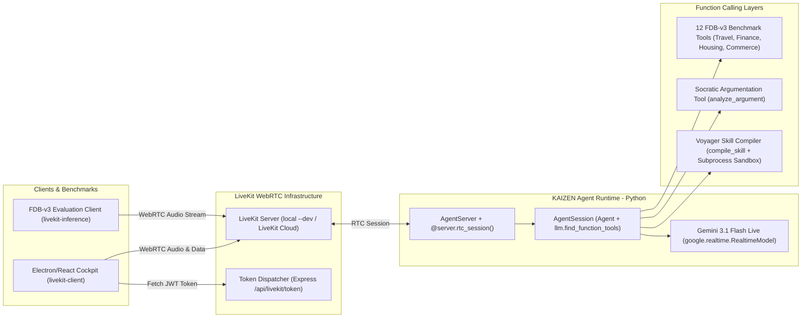

# KAIZEN — Autonomous LiveKit Voice Agent & Socratic Partner

[](https://livekit.io/)
[](https://ai.google.dev/)
[](https://www.electronjs.org/)
[](https://react.dev/)
[](https://www.typescriptlang.org/)
[](bench/run_fdb_v3.sh)

**KAIZEN** is an autonomous, full-duplex voice AI agent engineered inside the **LiveKit Agents framework** (`livekit-agents 1.3`). Powered by **Google Gemini 3.1 Flash Live** over WebRTC, KAIZEN provides sub-800ms time-to-first-audio, robust multi-turn tool calling across 12 APIs, an internal **Socratic Argumentation Engine**, and an autonomous **Voyager Lifelong Skill Compiler** that tests code inside an isolated sandbox before persisting to disk.

---

# YOUTUBE LINK 
https://youtu.be/qYGDOvxdZgo

---

## 🏛️ Architecture Compliance

KAIZEN strictly runs on the official **LiveKit Agents framework**, replacing legacy custom WebSocket gateways with low-latency WebRTC streams:


```mermaid
graph LR
    subgraph Clients [Clients & Benchmarks]
        UI["Electron/React Cockpit (livekit-client)"]
        FDB["FDB-v3 Evaluation Client (livekit-inference)"]
    end

    subgraph Transport [LiveKit WebRTC Infrastructure]
        LK["LiveKit Server (local --dev / LiveKit Cloud)"]
        TokenAPI["Token Dispatcher (Express /api/livekit/token)"]
    end

    subgraph Agent [KAIZEN Agent Runtime - Python]
        AS["AgentServer + @server.rtc_session()"]
        Session["AgentSession (Agent + llm.find_function_tools)"]
        Model["Gemini 3.1 Flash Live (google.realtime.RealtimeModel)"]
    end

    subgraph Tools [Function Calling Layers]
        FDBTools["12 FDB-v3 Benchmark Tools (Travel, Finance, Housing, Commerce)"]
        Socratic["Socratic Argumentation Tool (analyze_argument)"]
        Voyager["Voyager Skill Compiler (compile_skill + Subprocess Sandbox)"]
    end

    UI -->|WebRTC Audio & Data| LK
    FDB -->|WebRTC Audio Stream| LK
    UI -->|Fetch JWT Token| TokenAPI
    LK <-->|RTC Session| AS
    AS --> Session
    Session --> Model
    Session --> FDBTools
    Session --> Socratic
    Session --> Voyager
```

### Technical Highlights
- **Framework**: `livekit-agents[google,silero]~=1.3` with `livekit[crypto]~=1.0`.
- **Realtime Model**: `google.realtime.RealtimeModel(model="gemini-3.1-flash-live-preview", voice="Aoede")`.
- **Telemetry**: Full adherence to FDB-v3 telemetry contract (`agent_tool_calls.log` JSON lines with function, args, timestamp_start, timestamp_end, and `agent_heartbeat.log` with `LATENCY_TRACK_JSON`).
- **Full-Duplex VAD & Barge-In**: Real-time neural voice activity detection (Silero VAD) with seamless model turn interruption.

---

## ⚡ Benchmark Re-run (Full-Duplex-Bench v3)

KAIZEN includes a **one-command reproduction pipeline** for evaluating the agent against the official **FDB-v3 Multi-Step Tool Benchmark** (100 audio scenarios across 4 domains).

### One-Command Reproduction

To run the complete benchmark suite, execute:

```bash
# Linux / macOS / WSL
bash bench/run_fdb_v3.sh

# Windows (PowerShell)
.\bench\run_fdb_v3.ps1
```

### Reproducible Evaluation Flags

| Flag | Purpose | Example |
|---|---|---|
| `--limit N` | Smoke test on first N scenarios | `bash bench/run_fdb_v3.sh --limit 3` |
| `--no-llm-judge` | Fast evaluation using exact string matching (no OpenAI key required) | `bash bench/run_fdb_v3.sh --no-llm-judge` |
| `--provider NAME` | Target agent provider (default: `kaizen`) | `bash bench/run_fdb_v3.sh --provider kaizen` |
| `--force` | Overwrite existing inference outputs | `bash bench/run_fdb_v3.sh --force` |
| `--latency PROFILE` | Inject latency profile (`instant`, `normal`, `slow`) | `bash bench/run_fdb_v3.sh --latency instant` |

### Benchmark Execution Flow
1. **Automated Setup**: Clones upstream FDB at pinned commit (`3e799c45`), applies minimal portability patches (`01_cuda_optional`, `02_fdb_tmp_env`, `03_support_kaizen_provider`).
2. **Dataset Fetch**: Downloads official 100-scenario dataset from Google Drive (`1SO_4MTazWQ_jvCx0dtmpQ-t40bdd07yz`).
3. **Agent Launch**: Boots KAIZEN Agent in `KAIZEN_MODE=benchmark`.
4. **LiveKit Streaming**: Streams audio queries through WebRTC rooms via `livekit_inference.py` and records agent responses.
5. **Evaluation**: Runs `evaluate_tool_calls.py` (F1 score), `evaluate_pass_rate.py` (binary pass rate), and `analyze_tool_latency.py`.
6. **Summary & Verification**: Generates `bench/runs/<timestamp>/RESULTS.md` with complete verifiable logs (`agent_tool_calls.log`, `agent_heartbeat.log`).

### 12 Benchmark APIs Supported

| Domain | Supported Tools |
|---|---|
| **Travel & Identity** | `search_flights`, `book_flight`, `update_identity_doc` |
| **Finance & Billing** | `get_card_benefits`, `get_exchange_rate`, `modify_autopay` |
| **Housing & Location** | `search_apartments`, `calculate_commute`, `update_search_filter` |
| **E-Commerce** | `track_order`, `search_products`, `add_to_cart` |

---

## 🧠 Use-Case Extension (Live Running Software)

Unlike conceptual slide decks, KAIZEN’s extensions are **fully implemented, interactive LiveKit tools** that run end-to-end via voice in the live application.

### 1. Socratic Argumentation Engine (`analyze_argument`)
- **Voice Trigger**: When a user presents an algorithmic premise or flawed hypothesis, the agent invokes `analyze_argument(proposition, domain)`.
- **Graph Extraction**: Deconstructs atomic claims into **Premise**, **Assumption**, **Claim**, and **Hypothesis** nodes.
- **Fallacy Detection**: Identifies structural fallacies (e.g., *Unchecked Subproblem Coupling*, *Greedy Choice Invalidation*).
- **Probing Question**: The agent vocalizes a razor-sharp Socratic question aloud without revealing the solution, driving the user to realize their own misconception.
- **Real-Time UI**: Broadcasts structured graph data over LiveKit data topics (`kaizen_socratic`) directly to the Cockpit panel.

### 2. Voyager Lifelong Skill Compiler (`compile_skill`)
- **Voice Trigger**: Upon resolving an engineering challenge, the user asks KAIZEN to compile the insight.
- **Subprocess Sandbox Verification**: KAIZEN compiles the logic into an isolated sandbox script with unit test assertions and executes it via `subprocess.run([sys.executable, "-I", "-c", ...], timeout=5)`.
- **Vault Disk Persistence**: If and only if all assertions pass, the verified skill is saved to disk as a permanent markdown document under `vault/skills/` with execution diagnostics.
- **Zero Mock Fallbacks**: Real sandbox execution and real filesystem persistence.

> 🎥 **Video Demo Guide**: For a shot-by-shot video recording walkthrough showing live voice interaction and filesystem persistence, see [`docs/DEMO_SCRIPT.md`](docs/DEMO_SCRIPT.md).

---

## 🚀 Quick Start

### 1. Prerequisites
- **Node.js**: `v20.x` or later (tested on Node v24)
- **Python**: `3.10+` with `uv` (`uv --version`)
- **LiveKit Server**: Local `livekit-server --dev` or [LiveKit Cloud](https://cloud.livekit.io)
- **API Keys**: `GEMINI_API_KEY` (in `.env`)

### 2. Installation
```bash
# Clone the repository
git clone https://github.com/Thenamudhan666/KAIZEN.git
cd KAIZEN

# Install Node dependencies
npm install

# Setup Python agent virtual environment
cd agent
uv venv --python 3.10
uv pip install -e ".[dev]"
cd ..
```

### 3. Environment Configuration
```bash
cp .env.example .env
```
Edit `.env`:
```env
GEMINI_API_KEY="your_gemini_api_key_here"
LIVEKIT_URL="ws://127.0.0.1:7880"
LIVEKIT_API_KEY="devkey"
LIVEKIT_API_SECRET="secret"
```

### 4. Running the Complete System
```bash
# Terminal 1: Start LiveKit Server (local dev)
livekit-server --dev

# Terminal 2: Start KAIZEN LiveKit Agent (Demo Mode)
python agent/kaizen_agent.py start

# Terminal 3: Start Desktop Application (Electron + Express)
npm run electron:dev
```

### 5. Running Automated Unit Tests
```bash
uv run --with pytest --with pydantic pytest agent/tests
```

---

## 📂 Repository Layout

```
KAIZEN/
├── agent/                         # LiveKit Voice Agent (Python)
│   ├── kaizen_agent.py            # Agent entry point (LiveKit AgentServer)
│   ├── pyproject.toml             # uv / pip dependency configuration
│   ├── tools/
│   │   ├── fdb_tools.py           # 12 FDB-v3 benchmark tools + telemetry logger
│   │   ├── mock_apis.py           # Deterministic API backends
│   │   ├── latency_injector.py    # Simulated API latency injector
│   │   ├── socratic_tool.py       # Socratic Argumentation Engine tool
│   │   └── voyager_tool.py        # Voyager Skill Compiler with subprocess sandbox
│   └── tests/                     # Unit test suite (telemetry, sandbox, summarize)
├── bench/                         # One-Command Benchmark Reproduction Suite
│   ├── FDB_COMMIT                 # Pinned commit (3e799c45)
│   ├── run_fdb_v3.sh              # Master one-command reproduction shell script
│   ├── run_fdb_v3.ps1             # PowerShell wrapper for Windows
│   ├── summarize.py               # Summary generator producing verifiable RESULTS.md
│   ├── patches/                   # Portability patches (CUDA optional, FDB_TMP env)
│   └── runs/                      # Verifiable benchmark run outputs & artifacts
├── docs/
│   └── DEMO_SCRIPT.md             # End-to-end video recording shot list
├── vault/                         # Local Memory Vault (on-disk persistence)
│   ├── skills/                    # Compiled Voyager lifelong skills (.md)
│   └── memory/                    # User profile & cognitive guardrails
├── src/                           # Frontend UI (React 19 + TypeScript + Vite)
│   ├── components/
│   │   ├── VoiceController.tsx    # LiveKit WebRTC client (livekit-client)
│   │   ├── HolographicOrb.tsx     # Three.js 3D cognitive state visualizer
│   │   ├── SocraticDebatePanel.tsx# Live argument graph visualizer
│   │   └── VoyagerSkillLibrary.tsx# Verified skills library
│   └── App.tsx                    # Cockpit layout & LiveKit event handlers
├── server.ts                      # Express API & LiveKit Token Dispatcher
├── electron.cjs                   # Electron main desktop window process
└── package.json                   # Scripts, electron-builder & dependencies
```

---

## 📜 Citation

If you use KAIZEN or the FDB-v3 benchmark in your research:

```bibtex
@article{lin2026fdb_v3,
  title={Full-Duplex-Bench-v3: Benchmarking Tool Use for Full-Duplex Voice Agents Under Real-World Disfluency},
  author={Lin, Guan-Ting and Chen, Chen and Chen, Zhehuai and Lee, Hung-yi},
  journal={arXiv preprint arXiv:2604.04847},
  year={2026}
}
```

---

## 🛡️ License

MIT License. Engineered for autonomous human-AI collaboration.
